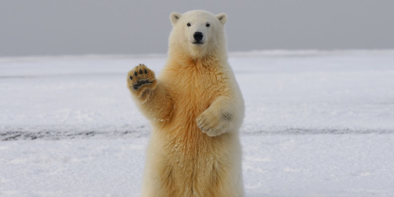

# Amazing Animals

Discover the fascinating world of Earth's creatures.

Over **8.7 million species** share our planet. From the deepest oceans to the highest mountains, life finds a way.

Let's explore the incredible diversity of the animal kingdom!
