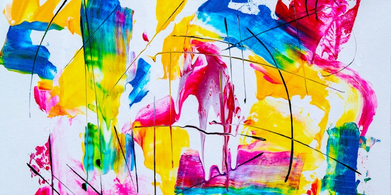

# Abstract Expressionism

## New York School (1940s-1960s)

- **Jackson Pollock** - Drip paintings
- **Mark Rothko** - Color fields
- **Willem de Kooning** - Abstract figures

Art became about the act of painting itself.

