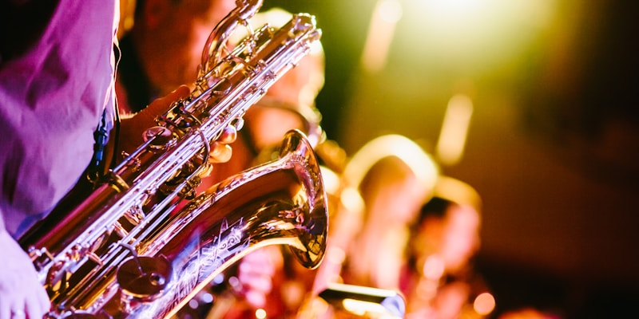

# Jazz & Blues

## American Roots
- **Blues** (1890s) - African American expression
- **Jazz** (1910s) - Improvisation & swing
- **New Orleans** - Birthplace of jazz

## Legends
- Louis Armstrong, Duke Ellington
- Miles Davis, John Coltrane
- B.B. King, Muddy Waters

Music that speaks from the soul.
