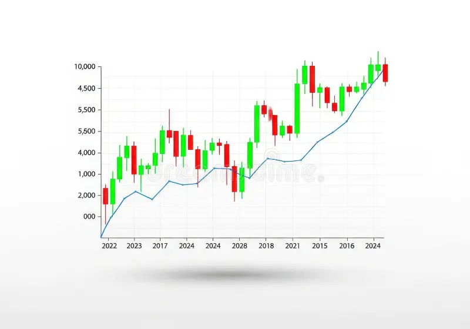

# Understanding Stock Price

Stock prices are determined by supply and demand—but what drives those forces? Let's break down what makes a stock's price move up or down.

## What Affects Stock Prices?

**Company Performance**

- Earnings reports (quarterly profits)
- Revenue growth
- New products or services
- Management changes

**Market Factors**

- Economic indicators (interest rates, inflation)
- Industry trends
- Investor sentiment
- News and events

**Valuation Metrics**

| Metric         | What It Measures             | Good Range               |
| -------------- | ---------------------------- | ------------------------ |
| **P/E Ratio**  | Price vs. earnings per share | 15-25 varies by industry |
| **EPS**        | Earnings per share           | Higher is better         |
| **Market Cap** | Total company value          | Depends on company type  |

## Bull vs. Bear Markets

**Bull Market**: Prices rising, investor confidence high (generally 20%+ increase from lows)

**Bear Market**: Prices falling, pessimism (generally 20%+ decline from highs)

## The Role of Emotions

Fear and greed drive short-term price swings. Smart investors focus on long-term business fundamentals rather than daily price movements.

> "In the short run, the market is a voting machine. In the long run, it's a weighing machine." — Benjamin Graham

<!-- Add an image here: Candlestick chart showing stock price movement -->
