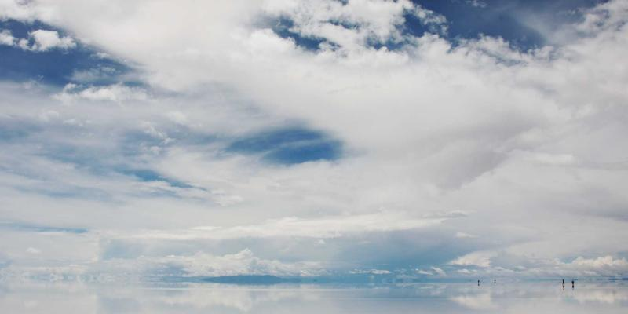

# Olympic Spirit

## Summer & Winter Games
- **206 nations** participate
- Over **300 events** across 35 sports
- Held every **4 years**

## Most Decorated
- Michael Phelps (23 gold medals)
- Larisa Latynina (18 total medals)

"Faster, Higher, Stronger - Together"
